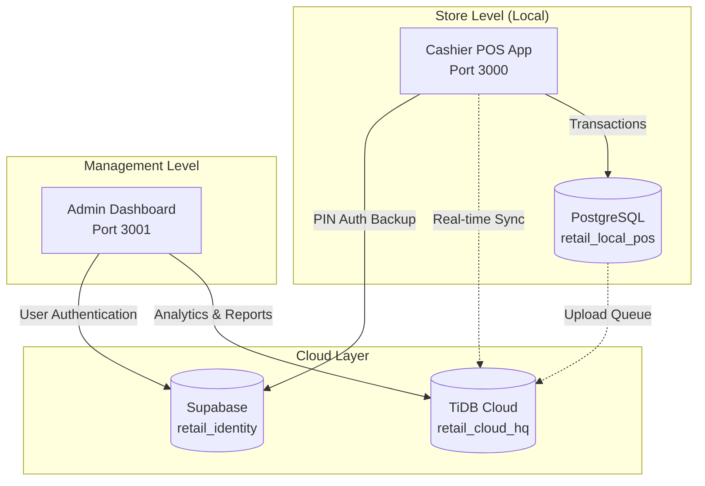
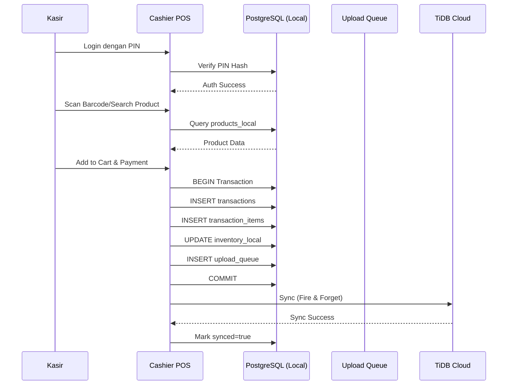
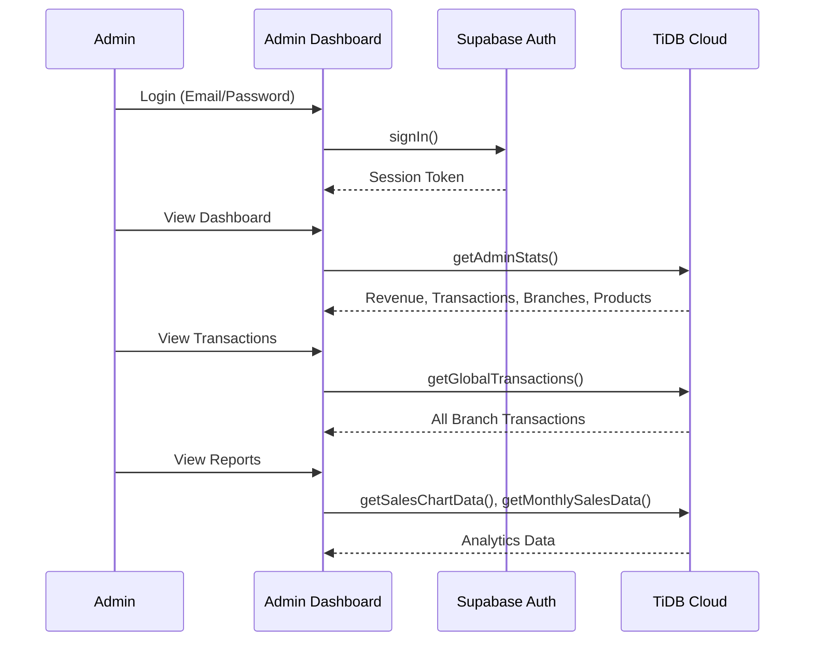
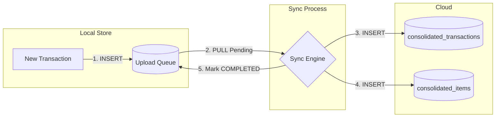

# Alfamart Retail POS System - Infrastructure Summary

## Executive Overview

Sistem **Alfamart Retail POS** merupakan sistem Point of Sale (POS) terdistribusi yang dibangun dengan arsitektur **hybrid cloud-local** untuk memastikan ketersediaan tinggi dan sinkronisasi data real-time. Sistem ini terdiri dari dua aplikasi utama: **Cashier POS** untuk operasional kasir di toko, dan **Admin Dashboard** untuk manajemen pusat. Arsitektur database menggunakan tiga layer: **Local PostgreSQL** untuk transaksi real-time, **TiDB Cloud** untuk konsolidasi data global, dan **Supabase** untuk autentikasi dan manajemen identitas.

---

## 1. Project Structure

```
alfa-retail-pos/
├── .env                          # Root environment variables
├── admin-dashboard/              # Cloud-first management dashboard (Port: 3001)
│   ├── src/
│   │   ├── app/                  # Next.js App Router
│   │   │   ├── dashboard/        # 6 sub-modules management
│   │   │   │   ├── branches/     # Branch management
│   │   │   │   ├── employees/    # Employee management
│   │   │   │   ├── products/     # Product catalog
│   │   │   │   ├── reports/      # Analytics & reports
│   │   │   │   ├── settings/     # System settings
│   │   │   │   ├── transactions/ # Transaction history
│   │   │   │   └── actions.ts    # Server actions (TiDB queries)
│   │   │   └── login/            # Supabase auth login
│   │   ├── components/           # UI components (shadcn/ui)
│   │   ├── lib/                  
│   │   │   ├── db.ts             # TiDB Cloud connection
│   │   │   └── utils.ts          # Utility functions
│   │   ├── types/                # TypeScript definitions
│   │   └── utils/supabase/       # Supabase SSR client
│   └── package.json              # Dependencies (Next.js 16, React 19)
│
├── cashier-pos/                  # Local-first POS for store (Port: 3000)
│   ├── src/
│   │   ├── app/                  
│   │   │   ├── pos/              # Main POS interface
│   │   │   │   ├── page.tsx      # POS UI (~28KB complex UI)
│   │   │   │   └── actions.ts    # Transaction & sync actions
│   │   │   └── login/            # PIN-based local auth
│   │   ├── components/           # UI components
│   │   ├── lib/
│   │   │   ├── db.ts             # PostgreSQL + TiDB connections
│   │   │   └── utils.ts          # Utility functions
│   │   ├── store/                # Zustand state management
│   │   ├── types/                # TypeScript definitions
│   │   └── utils/supabase/       # Supabase client backup
│   └── scripts/                  # Database setup scripts
│
└── reference/
    ├── FINAL_LOCAL_DB_SETUP.sql           # Local PostgreSQL schema
    └── QUERYSCRIPTREFRENCE/
        ├── DummyPostgres_LocalRetailScheme.sql   # Local seed data
        ├── DummySupabase_CloudCredential.sql     # Supabase seed data
        └── DummyTIDB_CloudGlobalScheme.sql       # TiDB seed data
```

---

## 2. Database Architecture

### 2.1 Overview Diagram



---

## 3. Database Details

### 3.1 LOCAL DATABASE - PostgreSQL

| Property | Value |
|----------|-------|
| **Host** | `localhost` |
| **Port** | `5432` |
| **Database** | `retail_local_pos` |
| **Purpose** | Primary database for store operations |
| **Connection** | `pg` (node-postgres) driver |

#### Tables (9 Total)

| # | Table Name | Primary Key | Description |
|---|------------|-------------|-------------|
| 1 | `store_config` | `config_id` (SERIAL) | Konfigurasi toko lokal (branch_id, branch_code, store_name, address, last_sync_ts, app_version) |
| 2 | `users_local` | `user_id` (BIGINT) | Master karyawan lokal dengan PIN hash untuk autentikasi offline |
| 3 | `products_local` | `product_id` (BIGINT) | Master produk dengan barcode, harga, kategori, stock, dan status aktif |
| 4 | `inventory_local` | `inventory_id` (SERIAL) | Tracking stok per cabang dengan qty_on_hand dan timestamp |
| 5 | `cash_shifts` | `shift_id` (BIGSERIAL) | Shift kasir dengan start/end cash, variance, dan status sinkronisasi |
| 6 | `transactions` | `transaction_uuid` (UUID) | Header transaksi dengan total, diskon, pajak, metode pembayaran |
| 7 | `transaction_items` | `item_id` (BIGSERIAL) | Detail item per transaksi dengan qty, price_at_sale, subtotal |
| 8 | `upload_queue` | `queue_id` (BIGSERIAL) | Antrian sinkronisasi ke cloud dengan retry mechanism |
| 9 | `defective_log` | `id` (SERIAL) | Log barang rusak/defect dengan reason |

#### Schema Detail - Core Tables

```sql
-- Store Configuration
CREATE TABLE store_config (
    config_id       SERIAL PRIMARY KEY,
    branch_id       INT NOT NULL,
    branch_code     VARCHAR(20) NOT NULL,
    store_name      VARCHAR(100),
    store_address   TEXT,
    last_sync_ts    TIMESTAMPTZ,
    app_version     VARCHAR(20) DEFAULT '1.0.0'
);

-- Users (Local Authentication)
CREATE TABLE users_local (
    user_id         BIGINT PRIMARY KEY,
    username        VARCHAR(50) NOT NULL UNIQUE,
    email           VARCHAR(100),
    pin_hash        VARCHAR(255),      -- For offline PIN auth
    role            VARCHAR(20),       -- CASHIER, STORE_LEADER, AREA_MANAGER, SUPER_ADMIN
    full_name       VARCHAR(100),
    branch_id       INT,
    is_active       BOOLEAN DEFAULT TRUE
);

-- Products Master
CREATE TABLE products_local (
    product_id      BIGINT PRIMARY KEY,
    barcode         VARCHAR(50) UNIQUE NOT NULL,
    name            VARCHAR(200) NOT NULL,
    price           NUMERIC(15, 2) NOT NULL,
    tax_rate        NUMERIC(5, 2) DEFAULT 0,
    category        VARCHAR(50),       -- FOOD, BEVERAGE, SNACK, CIGARETTE, etc.
    stock           INT DEFAULT 0,
    is_active       BOOLEAN DEFAULT TRUE,
    updated_at      TIMESTAMPTZ DEFAULT NOW()
);

-- Transaction Header
CREATE TABLE transactions (
    transaction_uuid UUID PRIMARY KEY DEFAULT gen_random_uuid(),
    branch_id        INT NOT NULL,
    shift_id         BIGINT REFERENCES cash_shifts(shift_id),
    user_id          BIGINT REFERENCES users_local(user_id),
    subtotal         NUMERIC(15, 2) NOT NULL,
    total_discount   NUMERIC(15, 2) DEFAULT 0,
    tax_amount       NUMERIC(15, 2) DEFAULT 0,
    grand_total      NUMERIC(15, 2) NOT NULL,
    payment_method   VARCHAR(50),      -- CASH, QRIS, DEBIT, SHOPEEPAY
    payment_ref      VARCHAR(100),
    cash_received    NUMERIC(15, 2) DEFAULT 0,
    change_returned  NUMERIC(15, 2) DEFAULT 0,
    created_at       TIMESTAMPTZ DEFAULT NOW(),
    synced           BOOLEAN DEFAULT FALSE
);

-- Upload Queue (Sync Mechanism)
CREATE TABLE upload_queue (
    queue_id        BIGSERIAL PRIMARY KEY,
    table_name      VARCHAR(50) NOT NULL,
    record_uuid     UUID,
    record_id       BIGINT,
    operation       VARCHAR(10) NOT NULL,  -- INSERT, UPDATE, DELETE
    payload         JSONB NOT NULL,
    created_at      TIMESTAMPTZ DEFAULT NOW(),
    retry_count     INT DEFAULT 0,
    status          VARCHAR(20) DEFAULT 'PENDING',  -- PENDING, COMPLETED, FAILED
    error_message   TEXT
);
```

#### User Roles & Hierarchy

| Role ID Range | Role | Permission Level |
|---------------|------|------------------|
| 9xxx | `SUPER_ADMIN` (CEO, Director) | Full system access |
| 8xxx | `AREA_MANAGER` | Multi-branch access |
| 7xxx | `STORE_LEADER` | Single branch management |
| 1xxx-2xxx | `CASHIER` | POS operations only |

---

### 3.2 CLOUD DATABASE - TiDB (MySQL Compatible)

| Property | Value |
|----------|-------|
| **Host** | `gateway01.ap-southeast-1.prod.aws.tidbcloud.com` |
| **Port** | `4000` |
| **Database** | `retail_cloud_hq` |
| **SSL** | TLSv1.2 (Required) |
| **Purpose** | Global HQ - consolidated data from all branches |
| **Connection** | `mysql2/promise` driver |

#### Tables (8 Total - Auto-Created)

| # | Table Name | Primary Key | Description |
|---|------------|-------------|-------------|
| 1 | `branches` | `branch_id` (AUTO_INCREMENT) | Master cabang dengan region dan alamat |
| 2 | `products_global` | `product_id` (AUTO_INCREMENT) | Katalog produk global dengan base_price |
| 3 | `users_global` | `user_id` (AUTO_INCREMENT) | Master karyawan global |
| 4 | `consolidated_transactions` | `global_id` (AUTO_INCREMENT) | Transaksi terkonsolidasi dari semua cabang |
| 5 | `consolidated_items` | `item_id` (AUTO_INCREMENT) | Detail item transaksi |
| 6 | `products_mirror` | `mirror_id` (AUTO_INCREMENT) | Mirror produk per cabang dengan stock |
| 7 | `defective_items_cloud` | `defective_id` (AUTO_INCREMENT) | Log barang rusak dari semua cabang |
| 8 | `sync_status` | `sync_id` (AUTO_INCREMENT) | Status sinkronisasi per cabang |

#### Schema Detail - Core Tables

```sql
-- Branches Master
CREATE TABLE branches (
    branch_id INT PRIMARY KEY AUTO_INCREMENT,
    branch_code VARCHAR(20) UNIQUE,
    branch_name VARCHAR(100) NOT NULL,
    region_name VARCHAR(100),      -- JABODETABEK, JAWA BARAT, etc.
    address TEXT,
    is_active TINYINT DEFAULT 1,
    created_at TIMESTAMP DEFAULT CURRENT_TIMESTAMP
);

-- Global Products Catalog
CREATE TABLE products_global (
    product_id BIGINT PRIMARY KEY AUTO_INCREMENT,
    barcode VARCHAR(50) UNIQUE,
    name VARCHAR(200) NOT NULL,
    category VARCHAR(50),
    price DECIMAL(15,2),           -- Base price (before margin)
    tax_rate DECIMAL(5,2) DEFAULT 11.00,
    is_active TINYINT DEFAULT 1,
    created_at TIMESTAMP DEFAULT CURRENT_TIMESTAMP
);

-- Consolidated Transactions (All Branches)
CREATE TABLE consolidated_transactions (
    global_id BIGINT AUTO_INCREMENT PRIMARY KEY,
    transaction_uuid VARCHAR(36) UNIQUE NOT NULL,
    branch_id INT NOT NULL,
    shift_id BIGINT,
    total_amount DECIMAL(15,2),
    payment_method VARCHAR(50),
    trx_date_local DATETIME,
    subtotal DECIMAL(15,2),
    total_discount DECIMAL(15,2),
    tax_amount DECIMAL(15,2),
    cash_received DECIMAL(15,2),
    change_returned DECIMAL(15,2),
    user_id BIGINT,
    created_at DATETIME DEFAULT CURRENT_TIMESTAMP
);

-- Consolidated Items (Transaction Details)
CREATE TABLE consolidated_items (
    item_id BIGINT AUTO_INCREMENT PRIMARY KEY,
    transaction_uuid VARCHAR(36),
    product_id BIGINT,
    qty INT,
    final_price DECIMAL(15,2),
    subtotal DECIMAL(15,2),
    product_name VARCHAR(200),
    category VARCHAR(50)
);

-- Sync Status Tracking
CREATE TABLE sync_status (
    sync_id BIGINT AUTO_INCREMENT PRIMARY KEY,
    branch_id INT NOT NULL,
    table_name VARCHAR(50),
    last_sync_at TIMESTAMP,
    records_synced INT DEFAULT 0,
    status VARCHAR(20) DEFAULT 'SUCCESS'
);
```

#### Regional Pricing System

TiDB menyimpan `product_prices_zone` untuk harga berbeda per region:

| Region | Margin | Example |
|--------|--------|---------|
| JABODETABEK | +15% | Base Rp10.000 → Sell Rp11.500 |
| JAWA BARAT | +12% | Base Rp10.000 → Sell Rp11.200 |

---

### 3.3 IDENTITY DATABASE - Supabase (PostgreSQL)

| Property | Value |
|----------|-------|
| **Host** | `aws-1-ap-southeast-1.pooler.supabase.com` |
| **Port** | `5432` |
| **Database** | `retail_post_credential` |
| **Project URL** | `https://izefsylukeytuihqjete.supabase.co` |
| **Schema** | `retail_identity` |
| **Purpose** | Authentication & user profile management |
| **Connection** | `@supabase/ssr` (Browser & Server) |

#### Tables (4 Total)

| # | Table Name | Primary Key | Description |
|---|------------|-------------|-------------|
| 1 | `branches` | `id` (INT) | Branch registry dengan server_ip |
| 2 | `users` | `id` (UUID) | Base user dengan email dan metadata |
| 3 | `profiles` | `id` (UUID) | Extended profile dengan role, branch_id, offline_pin |
| 4 | `audit_logs` | Auto | Activity logging (login, actions) |

#### Schema Detail

```sql
-- Using Schema: retail_identity

-- Branches Registry
CREATE TABLE retail_identity.branches (
    id INT PRIMARY KEY,
    branch_code VARCHAR(20),
    branch_name VARCHAR(100),
    address TEXT,
    server_ip VARCHAR(50)          -- Local server IP for sync
);

-- Users Base (Supabase Auth Integration)
CREATE TABLE retail_identity.users (
    id UUID PRIMARY KEY,
    email VARCHAR(100) UNIQUE,
    full_name VARCHAR(100),
    metadata JSONB                 -- Extended attributes
);

-- User Profiles (Role & Access)
CREATE TABLE retail_identity.profiles (
    id UUID PRIMARY KEY REFERENCES retail_identity.users(id),
    username VARCHAR(50),
    role retail_identity.user_role_enum,    -- ENUM type
    branch_id INT,
    status retail_identity.account_status_enum,  -- ACTIVE, INACTIVE
    offline_pin_hash VARCHAR(255)  -- For POS offline auth
);

-- Audit Logs
CREATE TABLE retail_identity.audit_logs (
    log_id BIGSERIAL PRIMARY KEY,
    user_id UUID,
    action VARCHAR(50),            -- LOGIN_CLOUD, TRANSACTION, etc.
    details JSONB,
    ip_address VARCHAR(50),
    created_at TIMESTAMPTZ DEFAULT NOW()
);
```

#### Supabase ENUMs

```sql
CREATE TYPE retail_identity.user_role_enum AS ENUM (
    'SUPER_ADMIN',
    'AREA_MANAGER', 
    'STORE_LEADER',
    'CASHIER'
);

CREATE TYPE retail_identity.account_status_enum AS ENUM (
    'ACTIVE',
    'INACTIVE',
    'SUSPENDED'
);
```

---

## 4. Application Flow

### 4.1 Cashier POS Flow



### 4.2 Admin Dashboard Flow



### 4.3 Sync Mechanism



---

## 5. Technology Stack

### 5.1 Frontend & Framework

| Technology | Version | Usage |
|------------|---------|-------|
| Next.js | 16 | App Router, Server Actions |
| React | 19 | UI Components |
| TypeScript | 5.x | Type Safety |
| Tailwind CSS | 4.x | Styling |
| Shadcn/UI | Latest | Component Library |
| Radix UI | Latest | Primitives |
| Framer Motion | Latest | Animations |
| Zustand | Latest | State Management |

### 5.2 Database Drivers

| Database | Package | Connection Style |
|----------|---------|------------------|
| PostgreSQL | `pg` | Pool (max 20) |
| TiDB/MySQL | `mysql2/promise` | Pool (limit 10) |
| Supabase | `@supabase/ssr` | Browser/Server Client |

### 5.3 Environment Configuration

```env
# Branch Identity
NEXT_PUBLIC_BRANCH_ID=101
NEXT_PUBLIC_BRANCH_CODE=JKT-001
NEXT_PUBLIC_BRANCH_NAME="Alfamart Jakarta Timur"
NEXT_PUBLIC_REGION_NAME="JABODETABEK"

# Local PostgreSQL
POSTGRES_HOST=localhost
POSTGRES_PORT=5432
POSTGRES_DB=retail_local_pos
POSTGRES_USER=postgres
POSTGRES_PASSWORD=*****

# TiDB Cloud
TIDB_HOST=gateway01.ap-southeast-1.prod.aws.tidbcloud.com
TIDB_PORT=4000
TIDB_USER=*****
TIDB_PASSWORD=*****
TIDB_DATABASE=retail_cloud_hq
TIDB_SSL=true

# Supabase
SUPABASE_DB_HOST=aws-1-ap-southeast-1.pooler.supabase.com
NEXT_PUBLIC_SUPABASE_URL=https://izefsylukeytuihqjete.supabase.co
NEXT_PUBLIC_SUPABASE_ANON_KEY=*****
```

---

## 6. Admin Dashboard Modules

### 6.1 Module Overview

| Module | Path | Data Source | Features |
|--------|------|-------------|----------|
| **Dashboard** | `/dashboard` | TiDB | Stats overview, charts, quick actions |
| **Transactions** | `/dashboard/transactions` | TiDB | View all transactions, detail view |
| **Branches** | `/dashboard/branches` | TiDB | Branch management, performance |
| **Products** | `/dashboard/products` | TiDB | Global product catalog |
| **Employees** | `/dashboard/employees` | TiDB | User management |
| **Reports** | `/dashboard/reports` | TiDB | Analytics, monthly sales |
| **Settings** | `/dashboard/settings` | TiDB/Supabase | System configuration |

### 6.2 Server Actions (TiDB Queries)

| Action | Query Target | Description |
|--------|--------------|-------------|
| `getAdminStats()` | `consolidated_transactions`, `branches`, `products_global` | Dashboard KPIs |
| `getGlobalTransactions()` | `consolidated_transactions JOIN branches` | All transactions with branch info |
| `getTransactionDetails()` | `consolidated_items JOIN products_global` | Item details per transaction |
| `getAllBranches()` | `branches` | Branch listing |
| `getGlobalProducts()` | `products_global` | Product catalog |
| `getAllEmployees()` | `users_global` | Employee listing |
| `getSalesChartData()` | `consolidated_transactions` | 7-day sales chart |
| `getMonthlySalesData()` | `consolidated_transactions` | 12-month sales trend |
| `getBranchPerformance()` | `branches JOIN consolidated_transactions` | Top 5 branches by revenue |
| `getLifetimeStats()` | `consolidated_transactions` | All-time stats |

---

## 7. Cashier POS Features

### 7.1 Core Operations

| Feature | Implementation | Database |
|---------|----------------|----------|
| Product Search | `searchProductsAction()` | Local PostgreSQL |
| Barcode Scan | `getProductByBarcodeAction()` | Local PostgreSQL |
| Cart Management | Zustand Store | Client-side |
| Transaction Save | `saveTransactionAction()` | Local → Cloud Sync |
| Defective Log | `logDefectiveAction()` | Local PostgreSQL |
| Shift Management | `cash_shifts` table | Local PostgreSQL |

### 7.2 Payment Methods

| Method | Code | Handling |
|--------|------|----------|
| Cash | `CASH` | Cash received, change calculated |
| QRIS BCA | `QRIS_BCA` | External QR payment |
| Debit Mandiri | `DEBIT_MANDIRI` | Card terminal |
| ShopeePay | `SHOPEEPAY` | E-wallet |

### 7.3 Multi-Branch Support

```typescript
// Schema mapping per branch
function getSchemaForBranch(branchId: string | number): string {
    const id = String(branchId);
    switch (id) {
        case '101': return 'retail_jakarta';
        case '102': return 'retail_bandung';
        case '103': return 'retail_surabaya';
        default: return 'retail_jakarta';
    }
}
```

---

## 8. Data Synchronization

### 8.1 Sync Strategy

| Aspect | Implementation |
|--------|----------------|
| **Direction** | Local → Cloud (one-way) |
| **Trigger** | Immediate (fire-and-forget) |
| **Fallback** | Upload queue with retry |
| **Conflict** | UUID-based (no conflicts) |

### 8.2 Sync Process

1. **Transaction Commit** → Insert to `upload_queue` with status `PENDING`
2. **Instant Sync** → Fire async call to `syncTransactionToCloud()`
3. **Cloud Insert** → Insert to `consolidated_transactions` + `consolidated_items`
4. **Mark Complete** → Update `transactions.synced = true`, queue status `COMPLETED`
5. **Retry on Fail** → Increment `retry_count`, update `error_message`

### 8.3 Latency Monitoring

```typescript
// Check both database connections
async function checkLatency() {
    return {
        local: { status: 'online' | 'offline', latency: number },
        cloud: { status: 'online' | 'offline', latency: number }
    };
}
```

---

## 9. Security Considerations

### 9.1 Authentication

| Layer | Method | Storage |
|-------|--------|---------|
| Admin Dashboard | Email/Password | Supabase Auth |
| Cashier POS | PIN (4-digit) | Local `pin_hash` |
| Offline Mode | PIN verification | Local PostgreSQL |

### 9.2 Connection Security

| Database | Security |
|----------|----------|
| PostgreSQL | Local connection (no SSL) |
| TiDB Cloud | TLS 1.2 required |
| Supabase | HTTPS + Row Level Security |

### 9.3 Best Practices Applied

- Environment variables for credentials
- Connection pooling untuk performance
- Prepared statements (parameterized queries)
- Role-based access control (RBAC)
- Audit logging pada Supabase

---

## 10. Summary Table

| Aspect | Local PostgreSQL | TiDB Cloud | Supabase |
|--------|------------------|------------|----------|
| **Purpose** | POS Operations | Data Consolidation | Auth & Identity |
| **Tables** | 9 | 8 | 4 |
| **Used By** | Cashier POS | Both Apps | Both Apps |
| **Connection** | pg Pool | mysql2 Pool | @supabase/ssr |
| **SSL** | No | Yes (TLS 1.2) | Yes |
| **Region** | Local | AWS Singapore | AWS Singapore |

---

*Document generated: December 2024*  
*© Alfamart Retail POS System*
